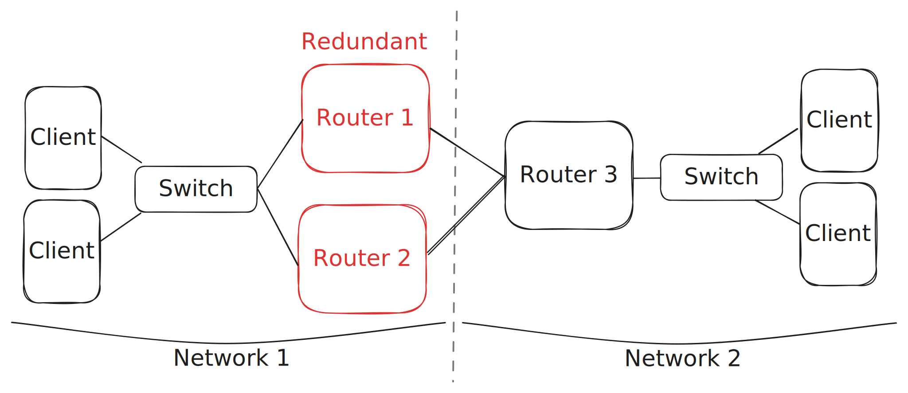

# {{ page.title }}

______________________________________________________________________

## Introduction

Hot Standby Router Protocol (HSRP) is a Cisco proprietary redundancy protocol that provides high availability for IP networks by allowing two or more routers to work together in a group. HSRP ensures that one router is actively forwarding traffic while the others are in standby mode, ready to take over in the event of a failure. This cheat sheet serves as a quick reference for configuring HSRP on Cisco devices.



______________________________________________________________________

## Configuration Steps

### Configuring HSRP

Use the following commands to configure HSRP:

```
Router# configure terminal
Router(config)# interface {INTERFACE_TYPE} {INTERFACE_NUMBER}
Router(config-if)# standby {GROUP_NUMBER} ip {VIRTUAL_IP}
Router(config-if)# standby {GROUP_NUMBER} priority {PRIORITY}
Router(config-if)# end
Router# write memory
```

______________________________________________________________________

## Commands

### Enter Configuration Mode

To enter global configuration mode for making HSRP configuration changes, use:

```
Router# configure terminal
```

### Define the Virtual IP Address

To set the virtual IP address for HSRP, use:

```
Router(config-if)# standby {GROUP_NUMBER} ip {VIRTUAL_IP}
```

### Set the Priority

You can adjust the priority of a router in the HSRP group with:

```
Router(config-if)# standby {GROUP_NUMBER} priority {PRIORITY}
```

### Verify HSRP Status

To check the status of HSRP groups and their interfaces, use:

```
Router# show standby
```

### Exit Configuration Mode

To exit configuration mode and return to privileged EXEC mode, run:

```
Router(config)# end
```

### Save Configuration Changes

To save the changes made to the configuration, use the following command:

```
Router# write memory
```
