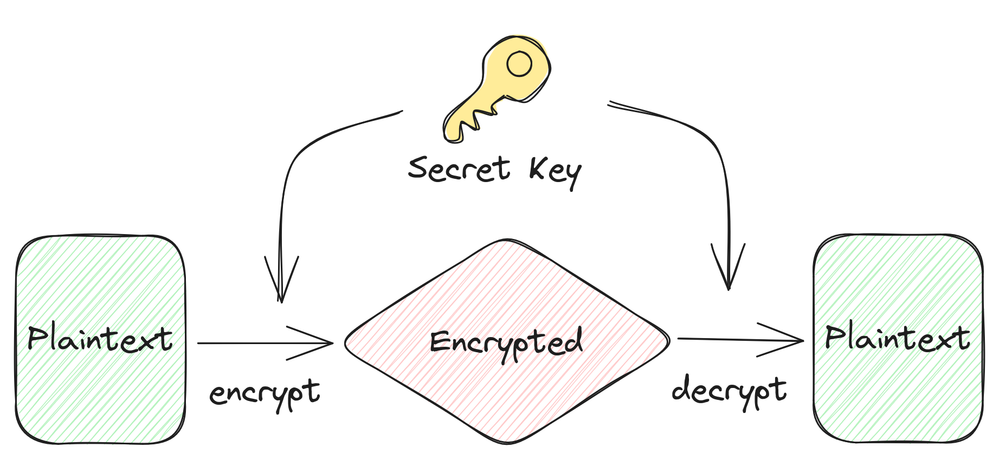
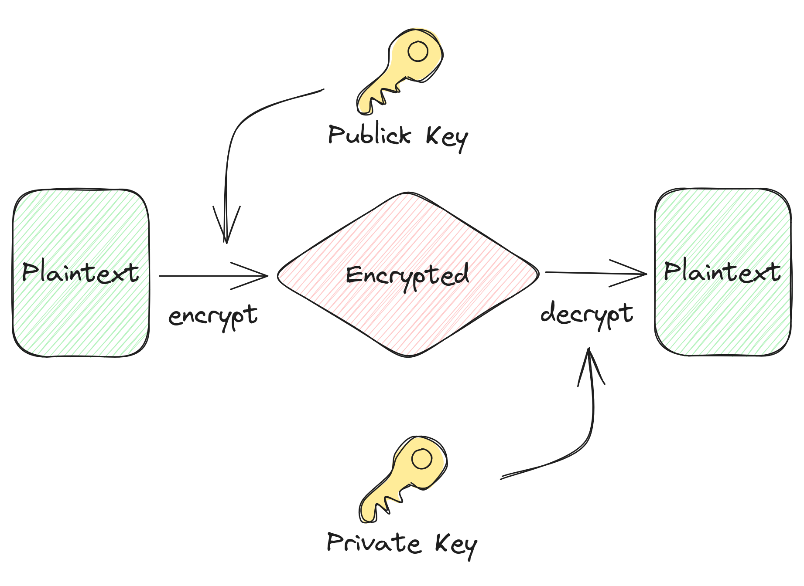

# {{ page.title }}

______________________________________________________________________

## Introduction

Encryption is a key concept in digital security, making data unreadable to unauthorised parties. This document describes two basic encryption methods, symmetric and asymmetric.

______________________________________________________________________

## Symmetric Encryption

Symmetric encryption is a fundamental cryptographic method that employs a shared secret key for both data encryption and decryption. All parties involved in communication must possess the same secret key, which must be securely exchanged beforehand. However, a significant drawback is the potential vulnerability of key exchange. If the secret key is transmitted in plaintext, it can be intercepted, compromising the security of the communication.

### Symmetric Encryption Process

## Asymmetric Encryption

Asymmetric encryption, also known as public-key encryption, introduces a fundamental change in the way encryption and decryption work. Instead of relying on a shared secret key, it utilizes a pair of keys: a private key and a public key. The public key is openly shared, allowing anyone to encrypt data, but only the corresponding private key holder can decrypt it.

### Asymmetric Encryption Process

