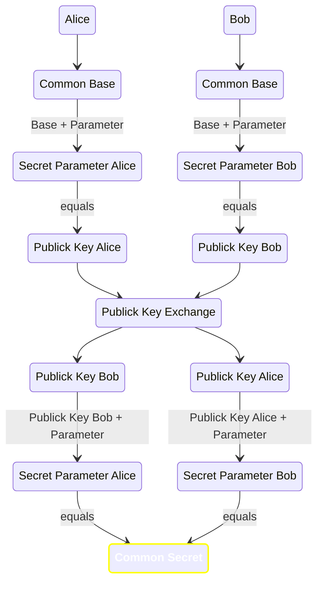

______________________________________________________________________

## Introduction

The Diffie-Hellman key exchange is a crucial solution to a fundamental problem in secure communication: the secure exchange of encryption keys. Traditional key exchange methods are vulnerable to interception, which is why the Diffie-Hellman method is widely adopted.

______________________________________________________________________

## How It Works

Diffie-Hellman key exchange offers two main variants: DHE and ECDHE. ECDHE, which employs Elliptic Curve Cryptography (ECC), provides efficient computation and higher security with shorter keys. Diffie-Hellman is widely used in secure communication protocols like TLS, SSH, and IPsec to enhance key exchange security.

1. Both parties generate public and private keys.
1. They agree on prime numbers and a base for key generation.
1. Parties keep private keys secret and share their public keys.
1. Using received public keys and the agreed base, both parties compute a shared session key.
1. This key enables a secure communication channel.
1. Sensitive data is never sent in plain text.

