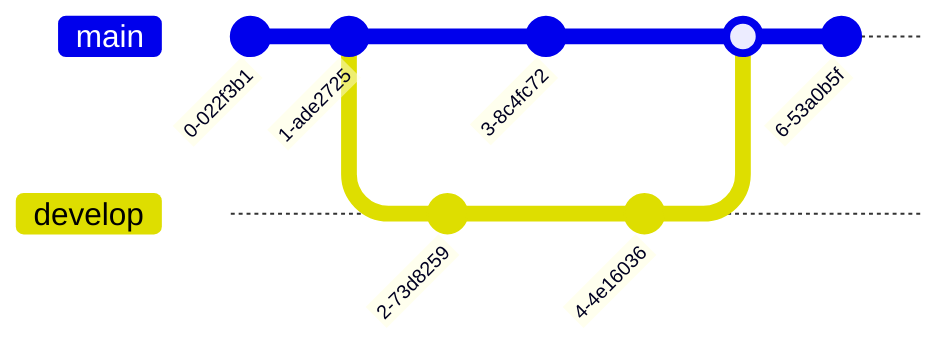

# {{ page.title }}

______________________________________________________________________

## Introduction

Branches are a fundamental concept in Git, allowing developers to work on different features or bug fixes in isolation from each other. The main branch is the default branch when you create a new repository. However, it's recommended to create and use other branches for development and then merge them back into the main branch when the work is complete.

______________________________________________________________________

### Visual representation of how branches work



### Creating and Switching to a New Branch

To create and switch to a new "develop" branch, use this command:

```
git checkout -b develop
```

### Switching Back to the Main Branch

To switch back to the main branch, use:

```
git checkout main
```

### Deleting a Branch

To delete the "develop" branch after merging changes, use:

```
git branch -d develop
```
