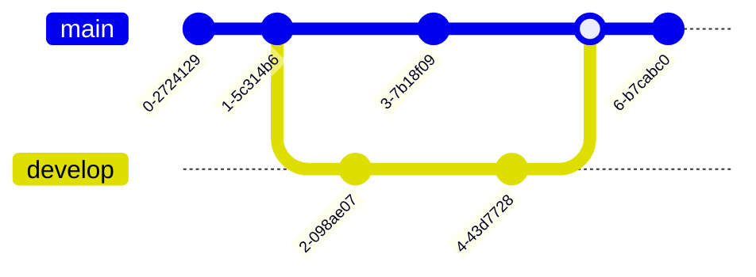

# {{ page.title }}

______________________________________________________________________

{: .note }

> Branches werden benutzt, um verschiedene Funktionen isoliert voneinander zu entwickeln.
> Der main-Branch ist der Standard-Branch, wenn du ein neues Repository erstellst.
> Du solltest aber für die Entwicklung andere Branches verwenden und diese dann in den
> Main-Branch zusammenführen.

______________________________________________________________________

Erstelle einen neuen Branch mit dem Namen develop und wechsle zu diesem

`git checkout --branch develop`

Um zu Main zurück zu wechseln

`git checkout main`

Den erstellten Branch wieder löschen

`git branch -d develop`
