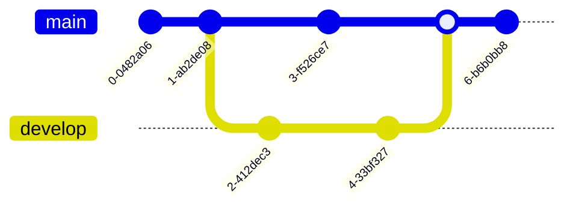

# {{ page.title }}

______________________________________________________________________

{: .note }

> Branches are used to develop different functions in isolation from each other.
> The main branch is the default branch when you create a new repository.
> But you should use other branches for development and then merge them into the
> main branch.

______________________________________________________________________

Create a new branch called develop and switch to it

`git checkout --branch develop`

To switch back to main

`git checkout main`

Delete the created branch

`git branch -d develop`
