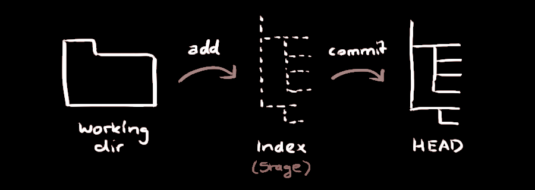

# {{ page.title }}

______________________________________________________________________

Dein lokales Repository besteht aus drei Instanzen, die von git verwaltet werden.
Die erste ist deine Arbeitskopie, welche die echten Dateien enthält.
Die zweite ist der Index, welcher als Zwischenstufe agiert und dem HEAD,
der auf deinen letzten Commit zeigt.



Du kannst Änderungen zum Index hinzufügen mit

`git add`

Du bestätigst deine Änderungen mit

`git commit -m "Commit-Nachricht"`

Um die Änderungen hochzuladen

`git push origin main`

Wenn du dein lokales Repository nicht von einem entfernten geklont hast, es aber mit einem anderen Repository verbinden möchtest

`git remote add origin`

Genereller Ablauf

```
git checkout -b FeatureBranch
git add .
git commit -m 'Changelog message'
git rebase -i # bei Bedarf
git checkout main
git merge FeatureBranch
git branch -d FeatureBranch
```
