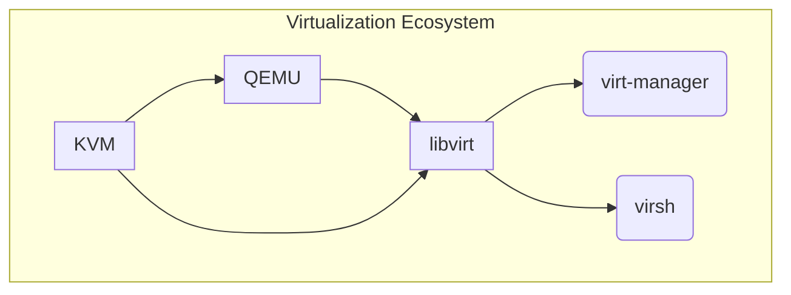

# {{ page.title }}

______________________________________________________________________

## Introduction

This cheat sheet provides an overview of key tools, their roles, relationships, and use cases within the Linux virtualization ecosystem.

______________________________________________________________________

## Key Tools

| Tool    | Description                                                                                                                                                      |
| ------- | ---------------------------------------------------------------------------------------------------------------------------------------------------------------- |
| KVM     | It leverages the Linux kernel on the host system to function as a hypervisor, providing near-native performance for virtual machines.                            |
| QEMU    | Versatile emulator and hypervisor. Can emulate various hardware components and CPU architectures. Also serves as a hypervisor with KVM for enhanced performance. |
| libvirt | Acts as a bridge between administrators and hypervisors, offering a standardized interface for managing virtual machines.                                        |

______________________________________________________________________

## Relationships

### QEMU with KVM

QEMU can collaborate with KVM to enhance virtualization capabilities. KVM handles hardware-level virtualization efficiently, while QEMU provides essential device emulation and management.

### libvirt with Hypervisors

libvirt serves as a universal manager that can orchestrate various hypervisors, such as QEMU/KVM, Xen, and VirtualBox. It harmonizes the diverse virtualization technologies, making them easier to control.

### virsh as a CLI interface for libvirt

virsh is a command-line tool that interfaces with libvirt. It empowers administrators to control virtual machines, networks, storage, and other resources consistently across multiple hypervisors.

